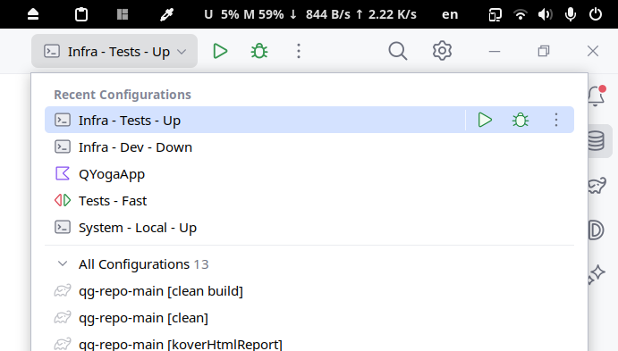
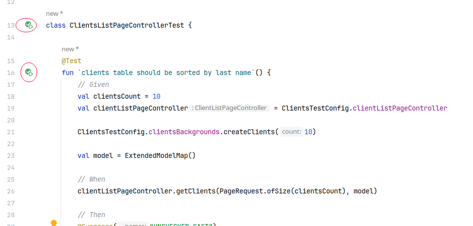
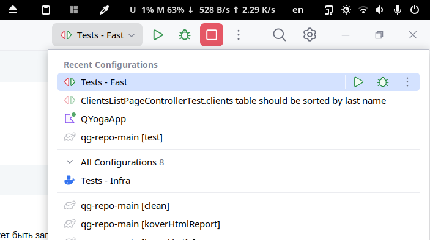
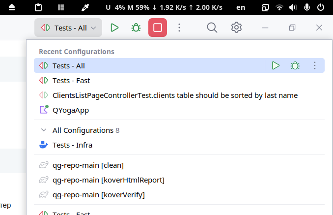
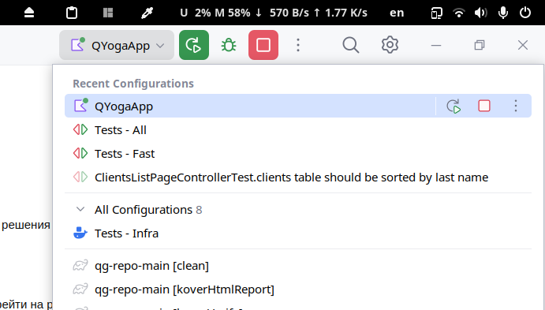
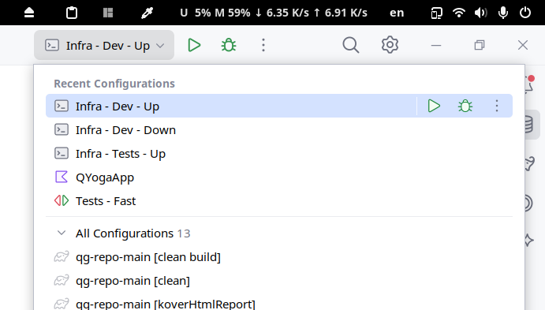
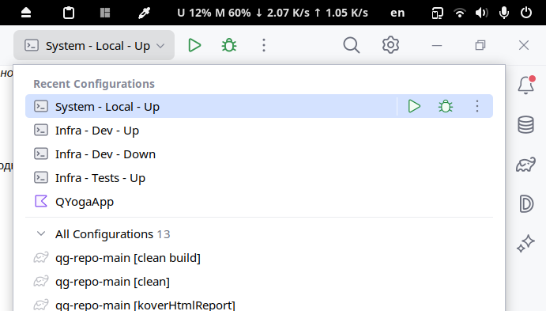
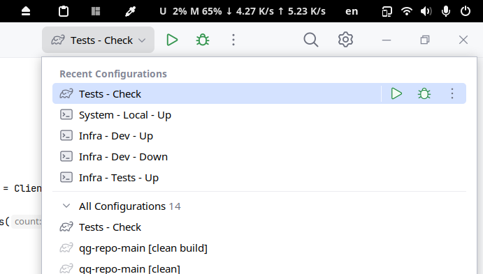

# QYoga

Информационная система йогатерапевта

## Требования к инфраструктуре

* JDK: 21 (Temurin)
* PostgreSQL 15.2

## Требования к рабочему окружению

* Docker
* Docker Compose

## Локальная разработка

### TDD

Разработку рекомендуется вести преимущественно через TDD - то есть реализация продового кода ведётся в рамках "
озеленения" теста.

#### Запуск инфраструктуры

Опционально можно руками запустить инфраструктуру для тестов c помощью IDEA Run Configuration (далее - ран конфига) "
Infra - Tests - Up":



Это позволит сэкономить полсекунды на запуск тестов, за счёт пропуска инициализации testcontainers.

_Вообще у IDEA есть специализированные ран конфиги для Docker Compose, но у меня идея крэшится при их использовании_

Остановить инфраструктуру можно ран конфигом "Infra - Tests - Down".

#### Запуск одного теста

В случае простых/небольших фич и багфиксов можно ограничиться запуском одного класса или теста через гуттер



#### Запуск быстрых тестов

Если изменения затрагивают несколько частей системы, их разработку можно драйвить с помощью ран конфига "Tests - Fast":



Эта конфигурация запускает все тесты, не отмеченные тегом "slow" и её есть смысл запускать, если в рамках решения
задачи, был затронут большой процент кода проекта.

#### Запуск всех тестов

Если разработка совсем вышла из-под контроля и починка одного теста влечёт падение другого, то лучше перейти на ран
конфиг "Tests - All":



### Ручное тестирование

Отладка и тестирования вёрстки и динамических частей страниц выполняется в ручном режиме, поэтому для этих целей
необходимо запустить проект с помощью ран конфига "QYogaApp":



В проекте настроена
интеграция [Spring Boot Docker Compose](https://docs.spring.io/spring-boot/docs/3.1.0/reference/html/features.html#features.docker-compose),
поэтому для запуска проекта достаточно запустить только само приложение в IDEA.

При изменении статических файлов (и, зачастую, кода) для их обновления не обязательно перезапускать приложение и
достаточно только пересобрать проект (Ctrl+F9).

При необходимости, остановить инфраструктуру можно ран конфигом "Infra - Dev - Down":



### Отладка приложения в контейнере

Для отладки работы приложения в докере можно воспользоваться ран конфигом "System - Local - Up":



Этот конфиг выполняет сборку приложения в jar-файл (из текущего состояния рабочей директории), после чего собирает
докер-контейнер на базе этого файла и затем в терминале запускает композ всей системы.

Композ запускается в интерактивном режиме, поэтому для остановки надо в консоли ввести Ctrl+c.

### Проверка перед пушем

Перед пушем рекомендуется запускать Gradle-таск check.
Этот таск выполняет все тесты, прогоняет код через detekt и проверяет процент покрытия кода тестами.
Для запуска таска можно воспользоваться ран конфигом "Tests - Check":



## Работа с продом

**Перед работой с продом на новой машине необходимо выполнить шаги из раздела "Сетап хоста"**

### Деплой

Для деплоя актуальной версии приложения необходимо выполнить скрипт:

```shell
deploy/host/deploy.sh
```

Этот скрипт подключится к серверу, загрузит последний образ приложения и задеплоит его.

### Просмотр логов

```shell
deploy/host/logs.sh
```

### Обновление сертификата

```shell
deploy/host/update-cert.sh
```

### Сетап хоста

```shell
deploy/host/setup-host.sh
```

### Сетап нового сервера

```shell
deploy/host/setup-server.sh
```
